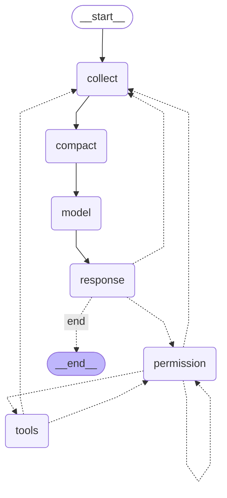

当前代码的 LangGraph 流程图。实线是固定边，虚线是条件边。


```mermaid
---
config:
  flowchart:
    curve: linear
---
graph TD;
	__start__([<p>__start__</p>]):::first
	collect(collect)
	compact(compact)
	model(model)
	response(response)
	permission(permission)
	tools(tools)
	__end__([<p>__end__</p>]):::last
	__start__ --> collect;
	collect --> compact;
	compact --> model;
	model --> response;
	permission -.-> collect;
	permission -.-> tools;
	response -. &nbsp;end&nbsp; .-> __end__;
	response -.-> collect;
	response -.-> permission;
	tools -.-> collect;
	tools -.-> permission;
	permission -.-> permission;
	classDef default fill:#f2f0ff,line-height:1.2
	classDef first fill-opacity:0
	classDef last fill:#bfb6fc
```

导出代码：

```python
from mini_harness.graph.builder import build_graph

graph = build_graph(None).get_graph()
print(graph.draw_mermaid())
```
